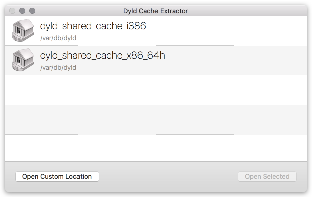
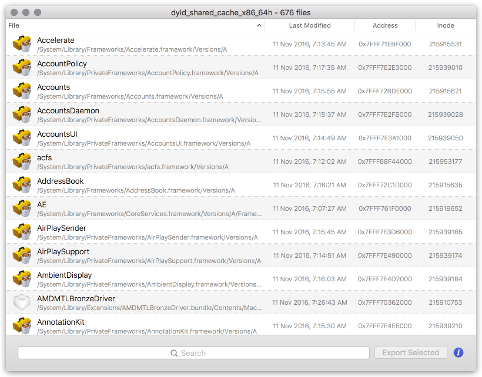

dyld_cache_extract
==================

  

### Notice

This project is now obsolete.  
Please take a look at the [dyld-cache-dump](https://github.com/macmade/dyld-cache-dump) project.

### About

A macOS utility to extract dynamic libraries from the `dyld_shared_cache` of macOS and iOS.

The project is available as a **macOS application (with GUI)** and as a **command line tool**.

### Command line usage

    dyld_cache_extract - Extractor utility for DYLD shared cache
    
    Available options:
        
        --help                            Shows this help dialog.
        --info [PATH]                     Displays informations about a dyld_shared_cache file.
        --extract-all [PATH] [OUT_DIR]    Extracts all libraries from a dyld_shared_cache file.
        --extract [LIB] [PATH] [OUT_DIR]  Extracts a specific library from a dyld_shared_cache file.

License
-------

Project is released under the terms of the MIT License.

Repository Infos
----------------

    Owner:          Jean-David Gadina - XS-Labs
    Web:            www.xs-labs.com
    Blog:           www.noxeos.com
    Twitter:        @macmade
    GitHub:         github.com/macmade
    LinkedIn:       ch.linkedin.com/in/macmade/
    StackOverflow:  stackoverflow.com/users/182676/macmade
